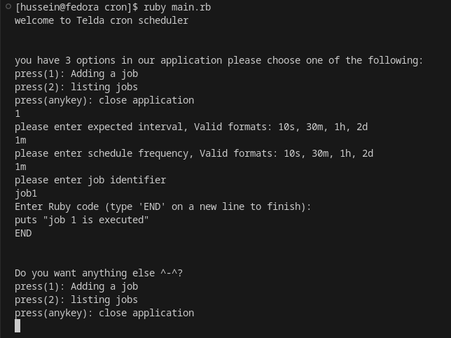
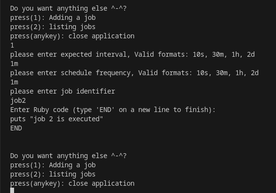
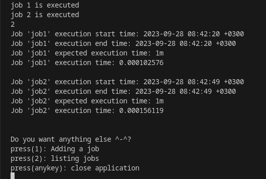
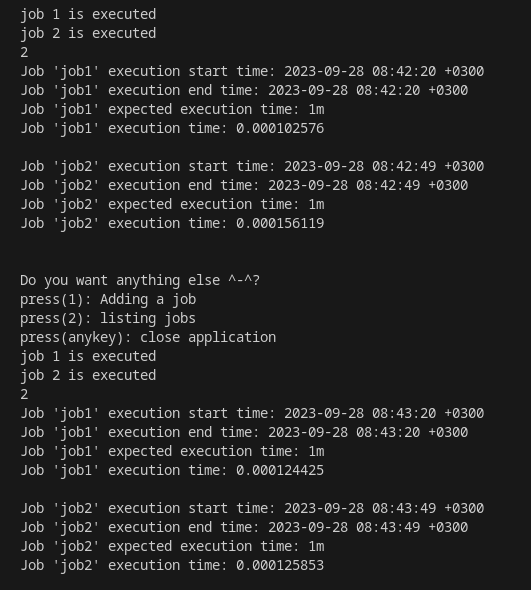
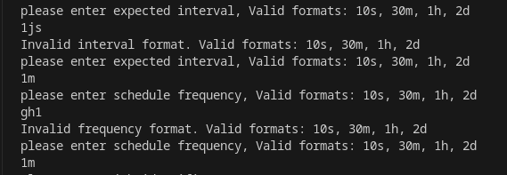
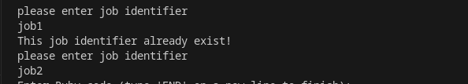

```
 .----------------.  .----------------.  .----------------.  .-----------------. .----------------. 
| .--------------. || .--------------. || .--------------. || .--------------. || .--------------. |
| |     ______   | || |  _______     | || |     ____     | || | ____  _____  | || |    _______   | |
| |   .' ___  |  | || | |_   __ \    | || |   .'    `.   | || ||_   \|_   _| | || |   /  ___  |  | |
| |  / .'   \_|  | || |   | |__) |   | || |  /  .--.  \  | || |  |   \ | |   | || |  |  (__ \_|  | |
| |  | |         | || |   |  __ /    | || |  | |    | |  | || |  | |\ \| |   | || |   '.___`-.   | |
| |  \ `.___.'\  | || |  _| |  \ \_  | || |  \  `--'  /  | || | _| |_\   |_  | || |  |`\____) |  | |
| |   `._____.'  | || | |____| |___| | || |   `.____.'   | || ||_____|\____| | || |  |_______.'  | |
| |              | || |              | || |              | || |              | || |              | |
| '--------------' || '--------------' || '--------------' || '--------------' || '--------------' |
 '----------------'  '----------------'  '----------------'  '----------------'  '----------------' 
```

 # Cron scheduler

This project is an in-process cron scheduler designed to facilitate the periodic execution of jobs. The scheduler allows clients to define jobs with specific characteristics, enabling flexible and customized scheduling.

## Table of Contents

- [Project file structure](#project-file-structure)
- [Example usage snippets](#example-usage-snippets)
- [Installation](#installation)
- [Possible future improvements](#possible-future-improvements)

## Project File Structure
`/main.rb:`
the main application file that has the interaction code that the client dealing with. let's see what is inside it:<br><br>
**Dependencies**
   - `require "./validate.rb"`: Imports custom validation methods for validating user inputs.
   - `require "./scheduler.rb"`: Imports the scheduler class for scheduling jobs and managing them.
   - `require "rufus-scheduler"`: Imports the Rufus-Scheduler gem for scheduling jobs.<br>

**Adding a Job (`add_job` function)**
   - The `add_job` function allows users to add a new job by specifying the expected interval, scheduling frequency, a unique job identifier, and a job implementation.
   - It takes a `job_list` as a parameter, representing the list of job_identifiers to validate and ensure the uniqueness of job identifiers.
   - Users are prompted to enter the expected interval, schedule frequency, and job identifier, ensuring the inputs are valid.
   - The `CronScheduler` object is created, and a job is scheduled using the provided parameters.<br>

**User Interaction Loop**
   - A loop enables continuous user interaction, presenting the user with options and allowing them to choose an action.
   - Options:
     - Option 1: Adding a job using the `add_job` function.
     - Option 2: Listing the jobs and displaying their execution logs.
     - Any other key: Closes the application and ends the loop.<hr>

`/validate.rb:`
 It contains custom validation methods for validating user inputs. let's see what is inside it:<br><br>
**`validate_interval(interval)`**
   - This function validates the format of the expected interval entered by the user.
   - It checks if the interval is in the format of a positive integer followed by a valid unit (s, m, h, d for seconds, minutes, hours, and days, respectively).
   - If the format is valid, it returns `true`. Otherwise, it prints an error message and returns `false`.<br>

**`validate_frequency(frequency)`**
   - Similar to `validate_interval`, this function validates the format of the scheduling frequency entered by the user.
   - It checks if the frequency is in the format of a positive integer followed by a valid unit (s, m, h, d for seconds, minutes, hours, and days, respectively).
   - If the format is valid, it returns `true`. If not, it prints an error message and returns `false`.<br>

**`validate_uniqueness(job_id_list, job_identifier)`**
   - This function ensures that the provided job identifier is unique.
   - It checks if the job identifier already exists in the list of job IDs (`job_id_list`).
   - If the identifier is unique, it returns `true`. If not, it prints an error message and returns `false`.<hr>

`/scheduler.rb:`
 It contains The `CronScheduler` class encapsulates the scheduling functionality for the application. It utilizes the Rufus-Scheduler gem to manage job scheduling and execution. let's see what is inside it:<br><br>

**`initialize`**
  - Initializes a new object of `CronScheduler`.
  - Sets up the Rufus scheduler and initializes an empty jobs hash to store job details.<br>

**`start`**
  - Initiates the scheduler by creating a new thread that joins the scheduler, it's actually a wrapper because `schedule.join` blocks the current thread till the scheduled jobs are finished and we don't want that we actually need it to work concurrently so I creating a new thread and joining it.<br>

**`schedule_job(identifier, frequency, expected, job)`**
  - Schedules a new job with the provided identifier, scheduling frequency, expected interval, and job implementation.
  - Adds the job details to the jobs hash and schedules the job using Rufus-Scheduler.<br>

- **`schedule_job_with_rufus(identifier, frequency)`**
  - Schedules the job using Rufus-Scheduler based on the given frequency.
  - Records job execution details like start time, end time, and execution time.<br>

**`log_job_execution`**
  - Logs the last execution details of all scheduled jobs, including start time, end time, expected execution time, and actual execution time.<hr>

## Example usage snippets
- `Insert the first job:`<br><br>
<hr>

- `Insert the second job:`<br><br>
<hr>

- `Instrument each job's details run after executing them`<br><br>
<hr>

- `Instrument each job's details run after executing them for the second time`<br><br>
<hr>

- `validation of expected interval and Scheduling frequency`<br><br>
<hr>

- `validating the uniqueness of job identifiers`<br><br>
<hr>

## Installation

Build the Docker image using the docker build command.
```bash
docker build -t your_image_name .
```
 <br>

Create a Docker container from the image you just built.
```bash
docker run -p  3000:3000 --name your_container_name -it your_image_name bash
```
<br>

write the command `bundle install` to ensure that all gems are installed.
```bash
bundle install
```
<br>

Run  `main.rb` and enjoy ^-^.
```bash
ruby main.rb
```
<hr>

## Possible future improvements
- We can add delete a job schedule option
- we can make our script accept more Scheduling frequency format
